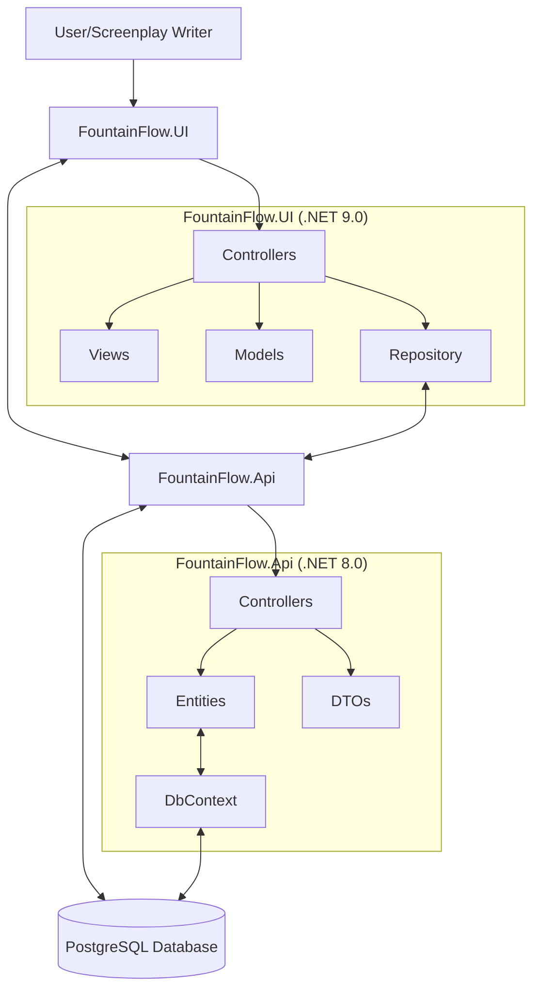

# FountainFlow Project Overview

## Project Purpose

FountainFlow is a collaborative platform for screenplay writers to work with AI as a co-creator. The core concept is an iterative approach to story content creation where rough ideas and notions are developed in a systematic manner with the AI playing the role of "conductor" and "muse". 

The platform "gamifies" the process of writing a screenplay by starting with a core idea (logline) and iteratively proceeding to develop and refine that idea until it is "right", then moving on to the next stage of development (such as theme choice and development). The AI offers variations of the human's ideas to improve them or suggest novel additions to the human's work.

## Architecture Diagram

## Design Pattern Incorporation

The FountainFlow solution incorporates several design patterns:

1. **Repository Pattern**: 
   - Implemented in the UI project with `ArchetypesRepository` that abstracts the data access logic
   - Provides a clean separation between the data access layer and the business logic
   - Uses interfaces like `IArchetypesRepository` to enable dependency injection and testability

2. **Model-View-Controller (MVC) Pattern**:
   - Both the UI and API projects follow the MVC architectural pattern
   - Controllers handle HTTP requests and responses
   - Models represent the data and business logic
   - Views (in the UI project) render the user interface

3. **Data Transfer Object (DTO) Pattern**:
   - Both projects use DTOs to transfer data between layers
   - Separates the domain/entity models from the presentation models
   - Examples: `ArchetypeDto`, `ArchetypeBeatDto`, `ArchetypeGenreDto`

4. **Dependency Injection**:
   - Used throughout both projects to inject dependencies
   - Improves testability and modularity
   - Services and repositories are registered in the DI container

5. **Unit of Work Pattern**:
   - Implemented via Entity Framework's `DbContext` in the API project
   - Manages database transactions and ensures data consistency

6. **Factory Pattern**:
   - Used in some services to create instances of other services or objects

## External Library Dependencies

### FountainFlow.Api Dependencies

- **Entity Framework Core (8.0.8)**: ORM for database access
- **Npgsql.EntityFrameworkCore.PostgreSQL (8.0.4)**: PostgreSQL provider for Entity Framework Core
- **AutoMapper (12.0.1)**: Object-to-object mapping library
- **Microsoft.AspNetCore.Mvc.Versioning (5.1.0)**: API versioning support

### FountainFlow.UI Dependencies

- **ASP.NET Core MVC**: Web framework for building the user interface
- **Bootstrap**: Front-end framework for responsive design
- **jQuery**: JavaScript library for DOM manipulation
- **DataTables**: jQuery plugin for table display and interaction
- **Chart.js**: JavaScript library for data visualization
- **CodeMirror**: Text editor for code/markup editing
- **D3.js**: JavaScript library for data visualization
- **ApexCharts**: Modern charting library

## Data Model

The FountainFlow data model is centered around screenplay structure and storytelling archetypes:

### Core Entities

1. **Story**: 
   - Represents a screenplay/story
   - Contains metadata like title, author, development stage
   - Links to LogLine, StoryLines, and other related entities

2. **StoryLine**: 
   - Individual lines in a screenplay
   - Contains sequence, line type, and text
   - Can be associated with ArchetypeBeats

3. **LogLine**: 
   - A concise summary of the story
   - Links to Archetype and Theme

4. **Theme**: 
   - Represents thematic elements of the story
   - Has ThemeExtensions for variations or aspects of the theme

5. **Archetype**: 
   - Story archetypes based on common storytelling patterns
   - Has a domain and associated ArchetypeBeats and ArchetypeGenres

6. **ArchetypeBeat**: 
   - Specific beats or moments in an archetype
   - Hierarchical structure with parent, child, and grandchild sequences
   - Contains name, description, and percentage of story

7. **ArchetypeGenre**: 
   - Genres associated with archetypes
   - Contains name and description

### Entity Relationships

- A Story has many StoryLines
- A Story has one LogLine
- A LogLine can reference an Archetype and a Theme
- A Theme has many ThemeExtensions
- An Archetype has many ArchetypeBeats and ArchetypeGenres
- StoryLines can reference ArchetypeBeats

## API Endpoints

The FountainFlow API provides RESTful endpoints for managing screenplay data:

### Archetypes

- `GET /api/v1.0/Archetypes`: Get all archetypes
- `GET /api/v1.0/Archetypes/{id}`: Get a specific archetype by ID
- `POST /api/v1.0/Archetypes`: Create a new archetype
- `PUT /api/v1.0/Archetypes/{id}`: Update an existing archetype
- `DELETE /api/v1.0/Archetypes/{id}`: Delete an archetype

### Archetype Beats

- `GET /api/v1.0/ArchetypeBeats/Archetype/{id}`: Get beats for a specific archetype
- `POST /api/v1.0/ArchetypeBeats/SaveBeats`: Save multiple beats at once

### Archetype Genres

- `GET /api/v1.0/ArchetypeGenres/Archetype/{id}`: Get genres for a specific archetype
- `POST /api/v1.0/ArchetypeGenres`: Create a new archetype genre
- `DELETE /api/v1.0/ArchetypeGenres/{id}`: Delete an archetype genre

## Development Environment

The FountainFlow solution is containerized using Docker:

- **API Container**: Runs the FountainFlow.Api project on port 6087
- **UI Container**: Runs the FountainFlow.UI project on port 6266
- **PostgreSQL**: External database (referenced in connection string)
- **Network**: Uses an external Docker network called "RallosZek-docker"

## Recommendations for AI Programming Conversations

When working with the FountainFlow codebase, consider the following:

1. **Focus on the Data Model**: The core of the application is the data model representing screenplay structure and archetypes. Understanding the entity relationships is crucial.

2. **UI-API Communication**: The UI communicates with the API via HTTP requests. The `ArchetypesRepository` in the UI project handles these communications.

3. **Database Operations**: Entity Framework Core is used for database operations. Migrations are managed through the API project.

4. **Versioned API**: The API uses versioning (currently v1.0), which should be maintained for backward compatibility.

5. **Error Handling**: The repository classes include comprehensive error handling with custom exceptions like `RepositoryException`.

6. **Hierarchical Data**: The ArchetypeBeat entity uses a hierarchical structure with parent, child, and grandchild sequences. This structure is important for maintaining the proper order of story beats.

7. **Validation Logic**: There is significant validation logic, especially for saving beats, which ensures data integrity and proper sequencing.

8. **Docker Deployment**: The application is designed to be deployed using Docker, with separate containers for the UI and API components.